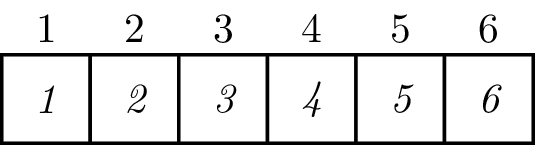

## Introduction
In this notebook, we will try to explain the most basic concepts of R
programming language, using `RStudio` effectively and good practices. However,
before we continue, we would like to recommend a few books that in our opinion
my help you to learn `R` and `RStudio` effectively.

* [R for Data Science](https://r4ds.had.co.nz) by Hadley Wickham and Garret
Grolemund -- we recommend it for both new R users and people who already have
some experience. 
* [Hands-on Programming with
R](https://rstudio-education.github.io/hopr/) by Garret Grolemund -- if you are
new to programming in general it will not harm you to give this book a try. 
* [Advanced R](https://adv-r.hadley.nz//introduction.html) by Hadley Wickham --
the title says it all.
the book [R for Data Science](https://r4ds.had.co.nz) by Hadley Wickham and
Garret Grolemund or for advanced users -- [Advanced
R](https://adv-r.hadley.nz/introduction.html) by Hadley Wickham. The former is a
very comprehensive and easy-to-understand introduction to R. Even if you have
already some experience with programming or with R in particular we would
strongly encourage you to give it a try.

The biggest advantage of all of them is that they might find them online free of
charge (this is publishers' policy not illegal copy).

## Useful keybindings

* `ctr` + `enter` (`cmd` + `return`) -- execute current line of the code 
* `ctr`+ `shift` + `enter` (`cmd` + `shift` + `return`) -- execute the whole chunk of
the code 
* `alt` + `-` -- write assign operator 
* `ctr` + `c` -- stop execution
of the current code 

## Documentation

In general, there are two ways of looking for documentation:

* `?mean()` -- if you type in the console a question mark followed by the name
of the function or package you would see the documentation in the bottom right
corner of your screen. 
* `??mean` -- if you type two question marks followed by
a word R will look for all help pages that consist of that word.

Some packages apart from simple documentation also provide Vignettes. There are
very useful resources that show examples of how to use certain functions and
also explain why to use them. I would say the latter is even more important than
the former.

## Errors

You will get errors and warnings very often, at least at the very beginning. It
is completely normal and part of the learning process. You will probably spend a
lot of time trying to figure out what you have done wrong and finally, you would
discover that it was a tiny thing that caused all the mess. Unfortunately, there
is no easy path here. It takes years of experience to really know what one is
doing. I have attended many R courses and only once saw a person who knew
exactly what was going to happen before it happened. It was dr John Foxx who is
not the father of Megan Fox but one of the members of the R Core Team -- meaning
he cocreated R. However, remember that one of the biggest advantages of
open-source software in general but also programming languages are the community
of users. Whenever you encounter an error or warning try googling it. You should
first look for answers on StackOverflow. If you can't find a simple solution try
to rephrase your question. Usually, someone has already had the same issue as
you do.

## Basic Math Operations

Likewise most of the programming languages you might consider `R` as a big fat
calculator. Therefore, you might use it to compute all basic and more advanced
calculations. For more information type into the console: `?Arithmetic`,
`?Trig`, `?log`.

```{r atomicArthmitics}
1 + 2       ## Addition
100 - 50    ## Subtraction
17 * 12     ## Multiplication
100 / 10    ## Division
4^(1/2)     ## Raising to a power
5%%4        ## Modulo
4%/%5       ## Integer division
```

## Objects

When you want to use the same value multiple times it is very inconvenient to
just type it every time you need it. Therefore, in programming languages, you
might assign values to objects. In other words, ''save'' the value. To do so you
just need to use the assignment operator and you can refer to the given object
in your script. If you assign value to an object the object of the given name
will appear in the top left panel.

```{r assign}
a <- 3 ## assign 3 to the object called a
b <- 7 ## assign 7 to the object called b
a*b ## let's multiply a by b
```

**Pro tip:** to type the assignment operator you can either type separately left
rectangle bracket (`<`) and follow it with the minus sign (`-`) or use RStudio
keybinding: `alt` + `-`.

## Print

Usually, when you start a course in a new language (programming) you start with
printing ''Hello world!''. We are going to skip this part and move straight to
using our first real function -- `print()`. When we assign value to the object
in most cases we will not get any output. In the previous chunk, we got 21
because we just asked `R` to multiply 7 by 3. If we assigned the results of this
operation to an object we would not see whether the result is 21 or not.

```{r print}
c <- a * b ## assign the result of multiplication to the object called c
```

But nothing happened! Nothing was printed out. Apart from the fact that object
`c` was created and now it is present in the top right panel. Then, how can we
print out the object we have stored in the environment? There are three main
ways to do so:


```{r printOptions}
a ## type the name of the object
print(b) ## use print function
(d <- a + b) ## use the brackets outside the expression you want to print
```

Although all these different options return the same output you would use them
in different contexts. If you continue your adventure with `R` in the future you
will learn when it is better to use each of them.

## Data Types and Structures in R

We already know how to use `R` and `RStudio` as a calculator but it would be
overkill to use it only for this purpose. However, I need to admit I sometimes
do it. I mean, in a very deep sense, even when we are browsing Facebook our
computers perform just calculations so all we do with our computers are just
more or less simple math operations...

Anyway, even if you have never had anything to do with programming you are
probably aware of the existence of different data types and structures. Other
than just simple numbers (are they just simple numbers though? -- we are not
going too deep into this). At least in school, you must have heard about
integers and matrices. Similarly, you see the difference between numbers and
characters in computer scientists differentiate between data types and
structures. In `R` programming language we have two main families of data types:

* atomic, for example, characters or numbers: `t`, `1`. 
  * _they cannot be divided into more primitive objects_ 
* complex, for example lists `list(a = 1, b = list(c = 2, d = 't'))`
  * _they consist of atomic or complex types_
  
### Atomic type

#### Numbers

We already know this type because we used it with our simple math operations.
But do we really know it? I think not. Let's start with creating a vector of
numbers. However, before we start let's see what is a vector. In a very naive
sense a vector is one-dimensional array looking like the one below:



This is very important to keep this picture in mind because it will help you to
understand what we are doing. If you are new to `R` you will not have a problem
with memorizing that the indexes start from 1, not from 0. For people with some
programming experience please note that indexes start from 1.

So how to create a vector? In general, there are two methods (actually three but
we will leave one out for time being).

```{r atomicVector}
1:6 ## create a vector of values from 1 to 6
(v <- c(1:6)) ## assign a vector of values from 1 to 6 to the object called v
```

When you assign a value to an object you actually create a vector of length 1.
We can easily check it using the function `is.vector` -- you might check the
documentation of this function to check whether it really checks if the object
is a vector but the name says it all.

```{r testVector}
is.vector(a) ## check whether an object is a vector
is.vector(b) ## check whether an object is a vector
is.vector(v) ## check whether an object is a vector
```

Therefore, all the objects we have created so far are vectors. They differ in
terms of their length and obviously the values they consist of. Let's first
check out how to check their values.

```{r lengthVector}
length(a)
length(b)
length(v)
```

So far so good. Let's now focus a bit on the numbers we were meant to discuss
(we needed to introduce vectors so we can store more than one value). Exactly,
like during Math in high school, we have different types of numbers. Probably,
for a very long time, we will not have to worry too much about the distinction
but it is good to at least be aware of the fact. So under numbers, we can
distinguish doubles, integers, and complex numbers. The distinction between
doubles and integers is very important when you perform memory-consuming
operations because computers use different ways to store numbers that seem to be
the same, for example, `1` and `1.0` have the same value but they are stored
differently by your computer.

```{r atomicNumbers}
c(1, 1.5, 0, -2, 30) ## vector of doubles (floats)
c(1L, 10L, 11L) ## vector of integers
c(2+3i, 101+17i) ## vector of complex numbers
```
```{r atomicNumbersClass}
typeof(c(1, 1.5, 0, -2, 30)) ## vector of doubles (floats)
typeof(c(1L, 10L, 11L)) ## vector of integers
typeof(c(2+3i, 101+17i)) ## vector of complex numbers
```

#### Logic values

The second data type we are going to talk about is logical values. We have two
logical values in `R`. It is a bit like in life. Something might be `TRUE` or
`FALSE`.

```{r atomicValues}
c(TRUE, FALSE)
```

**IMPORTANT:** Never use `T` instead of `TRUE` or `F` instead of `FALSE`. It
will make more trouble than it will save time. This is because you can create an
object called `T` while you can't create an object called `TRUE`. Therefore, it
might happen that you want to pass to your code `TRUE` but actually you assigned
something `T` somewhere in your script.

#### Characters

We have already seen quite a few different types of values, namely numbers (with
their different types) and logical values. However, it would be nice if we could
write something and compute textual values, right? Fortunately, yes, we can. In
`R` is called character (in other languages you would more often encounter the
name string).

```{r atomicCharacters}
first <- c("a", "b", "c") ## vector of characters
second <- c("first word", "second word", "third word") ## vector of characters
third <- c('1', '2', '3') ## vector of characters
```

Let's investigate strings for a moment. We can check both the length of the
vectors and their types. It should come as no surprise that the last vector is
also of character type, right? That is because the numbers are between quotation
marks, therefore, they are treated by `R` as a character, not a number.

```{r VectorCharactersLength}
## Check the length of the vectors
length(first)
length(second)
length(third)

## Check the type of the vectors
typeof(first)
typeof(second)
typeof(third)
```
However, let's investigate whether there is a difference between a single
character and a word.

```{r atomicCharacterLength}
## Let's assaign two characters to two different objects
c <- 'c'
w <- 'word'

## Do we expect them to be of the same length?
length(c)
length(w)
```

Why objects are of the same length? We can clearly see that `c` consist of 1
letter while `w` of 4. That is because `c` and `w` are vectors of length 1.
Obviously, there is a way to check the number of characters in both of them. We
would simply have to use the function called `nchar()`. But we are probably not
going to need it during this course. This example was meant to show you that
when you assign a value to the object actually are creating a vector of length
1.

#### Factors (_factors_)

This is very specific for the `R` data type. It is very useful when you
perform statistical analysis in `R` but at the beginning, it might be very
confusing and make you doubt. In simple terms, you might think about it as an R
representation of categorical variables. You will use it when your variable
takes a limited number of values (usually nonnumerical but not always).

```{r atomicFactors}
factor(c("factor I", "factor II")) ## vector of factors
```

#### Missing data

In `R` we have three (?) representations of missing value. 

* `NA` -- NA is a logical constant of length 1 and is an indicator for a missing
value. NA (capital letters) is a reserved word and can be coerced to any other
data type vector (except raw) and can also be a product when importing data. NA
and “NA” (as presented as string) are not interchangeable. NA stands for Not
Available.
* `NaN` -- stands for Not A Number and is a logical vector of a length 1 and
applies to numerical values, as well as real and imaginary parts of complex
values, but not to values of integer vector. NaN is a reserved word.
* `NULL` -- is an object and is returned when an expression or function results
in an undefined value. In the `R` language, NULL (capital letters) is a reserved
word and can also be the product of importing data with an unknown data type.

Ok, but what does it mean in practice?

```{r atomicMissingData}
c(NA, NaN, NULL) ## vector of missing data
```

Weird, right? A bit but let's not really discuss it and just remember it for now.

```{r atomicMissingDataLength}
## Let's just see the length of our vector
length(c(NA, NaN, NULL))

## Its class
typeof(c(NA, NaN, NULL))

## And classes of its elements
typeof(NULL)
typeof(NA) ## Isn't it a bit strange it is of type logical?
typeof(NaN)
```

### Logical operations

One of the unique features of the `R` programming language is its approach to
logical operations. Although in theory `R` uses classic Aristoteles logic with
two values (`FALSE` and `TRUE`) actually Łukasiewicz three-value logic approach
better describes how `R` treats logical values. In `R` we might distinguish three
logical values: `TRUE`, `FALSE`, and `NA` (missing data).

At first, it might sound and look a bit confusing but with practice, you will
see how useful this approach is. Below you will find the Truth Tables for three
the most basic logical operations: negation ($\neg$), conjunction ($\wedge$),
and disjunction ($\vee$).

#### Negation

The easiest logical operation is negation. In `R` to negate a logical value we use `!`.

```{r atomicLogicNegation}
x <- c(FALSE, TRUE, NA) ## vector of logical values
names(x) <- !x ## named vector of logical values. The names are negations of the values
x ## print the vector
```

#### Conjunction

In `R` the `&` or `&&` indicate the conjunction. The former performs an
elementwise comparison while the latter evaluates only the first elements of
each vector. Therefore, you must be very careful when you use the longer version
of the conjunction operator (it is useful though).

```{r atomicConjunction}
c(TRUE, FALSE) & c(TRUE, TRUE) ## elementwise conjunction
c(TRUE, FALSE) && c(TRUE, TRUE) ## first element comparison
```

The truth table for conjunction.

```{r conjunctionTruthTable}
x <- c(TRUE, FALSE, NA)
m <- outer(x, x, FUN = "&")
colnames(m) <- x
rownames(m) <- x
m
```

#### Disjunction

Similar to conjunction operators, in R, we have longer and shorter versions of
disjunction operators: `|` and `||`. The difference between them is similar to
the difference between `&` and `&&`.

```{r atomicDisjunction}
c(FALSE, FALSE) | c(FALSE, TRUE) ## elementwise disjunction
c(FALSE, TRUE) || c(FALSE, TRUE) ## first element comparison

```

The truth table for disjunction.

```{r disjunctionTrutTable}
x <- c(TRUE, FALSE, NA)
m <- outer(x, x, FUN = "|")
colnames(m) <- x
rownames(m) <- x
m
```

#### Comparisons

In general, we encounter logical values in `R` when we compare objects or their
values. The basic comparison operators are quite straightforward.

```{r comparisons}
# Comparisons operator
1 == 1      ## test for equality
1 != 1      ## test for non-equality
1 > 1       ## test for left beign bigger than right
1 < 1       ## test for right beeing bigger than left
1 >= 1      ## test for left being bigger or equal to right
1 <= 1      ## test for right being bigger or equal to left
```

This is all good, however, let's have a closer look at testing for equality.
Imagine you want to compare logical values or a number to a `NULL`.

```{r testEquality}
NA == TRUE ## atempt to compare missing data to logical value
5 == NULL ## attempt to compare NULL to number
```

Are you surprised? The result of our first attempt should come as no surprise.
How about the second one? This is important to be aware of because when you want
to compare things for equality you would expect to either get `TRUE` or `FALSE`
not any other value. Therefore, unless you exactly know what types you are
comparing you should use the `identical()` function instead. Let's see how it
goes this time around.

```{r equality}
identical(NA, TRUE) ## compare missing data to logical value
identical(NULL, 5) ## compare number to NULL

!identical(NA, TRUE)
!identical(5, NULL)
```

Actually in both cases using identical would be a bit of an overkill cause there
are dedicated functions to check whether an object is `NULL` (`is.null()`), `NA`
(`is.na()`), or `NaN` (`is.nan`).

### Operations on vectors

We have already mentioned that in `R` all atomic objects are treated as vectors.
So let's talk a bit more about them. When we asked you to imagine a vector we
showed you a one-dimensional array (at least something similar). Anyway, the
question is how to access the data we have stored in our vector.

```{r vectorsIndexes}
letters ## it is a built-in vector with all letters in English (almost cause the funny i is missing)

letters[1] ## to access the first element you just need to put its index in the square brackets
letters[1:20] ## you can access more elements if you address more indexes
letters[c(1,12:22)] ## you can combine both methods and get just some elements
letters[c(22:1)] ## you can also reverse the order of the elements

## Instead of selecting which elements you would like to get you can simply say which you would like to omit
## However, it might be a bit tricky

letters[-2] ## get all elements apart from the second one
letters[c(-2,-3)] ## get all elements of letters apart from its second and third elements
```

#### Nammed vectors

When I showed you negation I did some magic with vector so it was a vector but
apart from indexes it also had names. Afterward, we never really mentioned named
vectors. Now we will see how useful they can be. First, we can address the
values not only by indexes but also by their names. Let's see how it works in
practice.

```{r namedVectors}
(nammed_v <- c('one' = 1, 'two' = 2, 'three' = 3)) ## create a nammed vector

nammed_v['one'] ## access named vector by the name instead of the index
```

Ok, this looks pretty cool but why is it useful? We can use it to recode the
values of another vector. Let's imagine we have a character vector. It contains
only the following values: `one`, `two`, and `three`. We would like to recode
these character values into numbers. The obvious way of doing it is to recode
one element after another.

```{r bruteRecode}
## Create a 100-elements long character vector
(character_v <- sample(c('one', 'two', 'three'), size = 100, replace = TRUE))

## Check the first element
character_v[1]

## Assign number as the first element of the vector
character_v[1] <- 1

## Does it work and why not?
character_v

## Let's try creating a new vector
numeric_v <- vector(mode = 'numeric', length = 100) ## this the good practice to create an object first and later populate it
numeric_v[1] <- 1 ## assign 1 to the first index
numeric_v ## by defualt the vector would be populated with 0s
```

Although the method we sam in the previous chunk would work (unless we would
make a mistake). It is a very suboptimal solution. In the end, we are using a
computer so we should use its powers to perform a repetitive task. Therefore,
what would be the algorithm we would like to use to complete our recoding task?

1. Take the element of the vector under index `i`.
2. If it takes the value `one` write in a new vector `1` under the index `i`.
3. If it takes the value `two` write in a new vector `2` under the index `i`.
4. If it takes the value `three` write in a new vector `3` under the index `i`.

Can we implement such an algorithm easily in `R`? Obviously, like in most of the
programming languages we are going to use a for loop. How does it work?

```{r forLoop}
## Define the character vector
character_v <- sample(c('one', 'two', 'three'), size = 100, replace = TRUE)

## Define the empty numeric vector
numeric_v <- vector(mode = 'numeric', length = 100L)

## Create a for-loop
for (i in 1:length(character_v)){
  ## Use a if-statement
  if (character_v[i] == 'one') {
    numeric_v[i] <- 1
  }
  ## Use a if-statement
  if (character_v[i] == 'two') {
    numeric_v[i] <- 2
  }
  ## Use a if-statement
  if (character_v[i] == 'three') {
    numeric_v[i] <- 3
  }
}
character_v
numeric_v
```

Ok, it seems it worked pretty well but let's unpack it. What just happened and
how this `for-loop works and the `if-statement.

In `for-loop` we first defined the vector of indexes in the brackets. It
consists of all numbers from 1 to the length of our character vector (we could
have put 100 instead of length(character_v) but it is good practice to avoid
putting raw numbers). The for-loop will execute the code between curly brackets
exactly 100 times and in each iteration, it will assign a different number to
the object i. This is pretty cool because it allows us to access consequent
elements of our character vector.

In `if-statement` in brackets, we have a logical test for equality (we use a
double equal sign because we know what we expect both values to be). If the test
returns `TRUE` the code between curly brackets is executed.

Ok, this solution works but it is still not optimal. You probably realize by now
that we are meant to use somehow named vectors to recode the values.

```{r lookupVector}
## Define the character vector
(character_v <- sample(c('one', 'two', 'three'), size = 100, replace = TRUE))

## Define nammed vector -- lookup vector that will serve as a kind of dictionary
(lookup_v <- c('one' = 1, 'two' = 2, 'three' = 3))

## Use the lookup vector ot 
(numeric_v <- lookup_v[character_v])
```

Under the hood `R` will perform more or less the same action as we did with our
for-loop because it will take the first value from the character vector and
match it with the name from the lookup vector. Afterward, it returned the value
from the lookup_v. I would say it is the most elegant way to recode a simple
vector that `R` offers.

#### Operations on vectors

At this stage, we are not going to talk about Matrix Algebra but rather about
simple operations we can perform on vectors. It is important that `R` will
perform them elementwise. Let's see the examples:

```{r vectorsOperations}
c(2,3,4) + 1 ## add number to all elements of the vector
c(2,3,4) * 5 ## multiply all elements of the vector by the same number
c(2,3,4) / 2 ## divide all elements of the vector by the same number

c(2,3,4) + c(2,2,2) ## add vectors elements of two vectors elementwise
c(2,3,4) * c(2,2,2) ## multiply elements of two verctors elementwise
c(2,3,4) / c(2,2,2) ## divide elements of two vectors elementwise
```

This is more or less what we would have expected but what would happen if the
vectors are not the same length and none of them is of the length 1. Let's
investigate it.

```{r vectorsDifferentLength}
c(2,3,4) + c(2,3) ## what R does is creation of a result vector c(2+2, 3+3, 4+3)
c(2,3,4) * c(2,3) ## what R does is creation of a result vector c(2*2, 3*3, 4*2)
c(2,3,4) / c(2,3) ##  what R does is creation of a result vector c(2/2, 3/3, 4/3)
```

## Complex types

In `R` we have multiple complex types. Actually, we might say that there is an
infinite number of them because they might consist of themselves. Therefore, we
will just focus on three main that we will use later: matrices (`matrix`), lists
(`list`), and data frames (`data.frame`)

### Matrices

In `R`, a matrix is a vector that has information about its dimensions. It
looks a bit like a table but it can only consist of elements of the same type.
Therefore, we can have a numeric matrix, logical matrix, character matrix, etc.

```{r compleMatrix}
M <- matrix(1:9, ncol = 3, nrow = 3)    ## create a matrix
M
dim(M)  # dimmensions of a matrix
```

### Lists

Lists are the most important complex data structures in `R` because they are
fundaments of other structures, for example, data frames are a special case of a
list (we will see it at the moment). A list is a bit similar to a vector. It
consists of indexed elements but unlike in the case of vectors, its elements
might be of different types (not only atomic types but also complex ones).
Therefore, a list might consist of another list nested.

```{r complexLists}
## Let's create a list
list_example <- list(1, a = 2, list(a = 2, b = 4), b = list(a = NULL, b = head(iris, n = 5)))

print(list_example) ## in this case it is better to use the print function than just type the name of the list

list_example[2] ## show the second element of the list
list_example[[2]] ## show the value of the second element of the list
```

### Data frames (`data.frame`s)

From the perspective of statistical analysis, the most important data structure
is a data frame (`data.frame`). You might think about it as an Excell table. A
data frame usually consists of rows (observations) and columns (variables).
Therefore, it is a rectangle-shaped data structure that unlike matrices might
consist of different types of data (also complex ones). In `R` you might index
both by columns and rows.

We will use the famous built-in `R` Ronald Fisher data set -- `iris` -- to show
you some basic operations on data frames.

```{r complexDataFrame}
iris
```
```{r complexDataFrameOperations}
## Show column names
colnames(iris)

## Show number of rows
nrow(iris)

## Show number of columns
ncol(iris)

## We can also use dim function on the data set
dim(iris)

## Show first n rows
head(iris, n = 10)

## Show last n rows
tail(iris, n = 3)

## Show summary of the data set
summary(iris)
```
```{r complexDataFrameIndexes}
## Extract a column by name
iris$Sepal.Length

## Extract the column by index
iris[,2]

## Extract row by index
iris[2,]

## Filter data by columns
iris[iris$Species == 'setosa', 'Sepal.Length']
```
